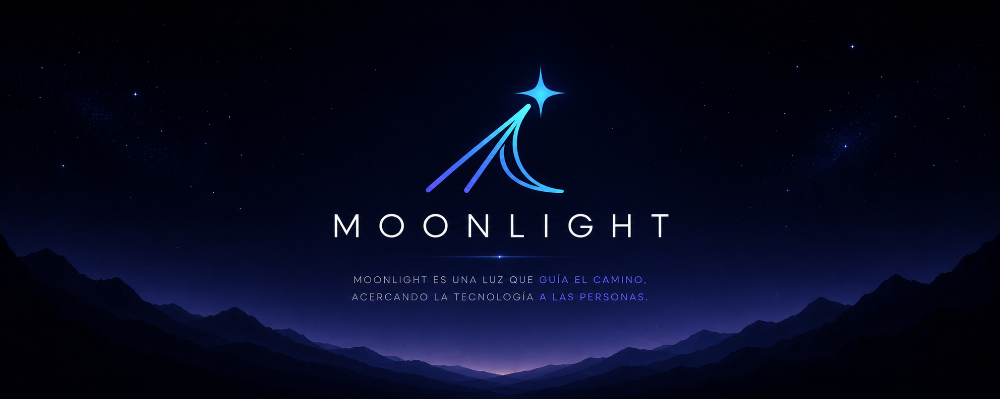

 

## Construyendo Moonlight.

> *La inteligencia artificial no debería reemplazarte.*  
> **Debería ayudarte a llegar más lejos.**

  

---

## Fabián Prado

Soy desarrollador de software y creador de **Moonlight**, un asistente de inteligencia artificial diseñado para potenciar a las personas, no reemplazarlas.

Creo que el futuro de la IA no depende únicamente de modelos más inteligentes, sino de experiencias más humanas, intuitivas y privadas.

Actualmente dedico mi tiempo a construir Moonlight con esa visión.

---

# 🌙 Manifiesto de Moonlight

Moonlight nació de un sueño.

El sueño de crear un asistente que no se limitara a responder preguntas, sino que ayudara a descubrir respuestas, desarrollar ideas y crecer junto a quienes lo usan.

No para hacer las cosas por ti.

Sino para ayudarte a llegar más lejos.

Como la luz de la luna...

Nunca pretende reemplazar al sol.

Solo aparece cuando más la necesitas.

No ilumina todo el camino.

Solo lo suficiente para ayudarte a dar el siguiente paso.

**Así nació Moonlight.**

---

# 👋 Hola, soy Fabián Prado

Soy desarrollador y creador de **Moonlight**.

Me apasiona crear tecnología que se sienta natural, intuitiva y humana.

Creo que el software no debería obligarnos a cambiar nuestra forma de trabajar.

Debería comprendernos, adaptarse a nosotros y ayudarnos a alcanzar nuestro máximo potencial.

---------

Actualmente construyendo

🌙 Moonlight

🤖 Arquitecturas de IA

💻 Aplicaciones Desktop

✨ Experiencias centradas en el usuario
---------

# 🌙 ¿Qué es Moonlight?

Moonlight nace de una idea muy simple:

> **La mejor tecnología es aquella que se siente invisible.**

Más que un chatbot, Moonlight busca convertirse en un compañero inteligente.

Un asistente capaz de comprender el contexto, adaptarse a cada persona y hacer que interactuar con la inteligencia artificial se sienta natural.

No pretende responder todas las preguntas.

Pretende ayudarte a descubrir mejores respuestas.

---

# 🛠 Tecnologías

Actualmente trabajo con:

JavaScript • TypeScript • React • Node.js • Electron • Python • IA

---

# 🚀 Proyecto Principal

## 🌙 Moonlight

El proyecto central de mi ecosistema.

Actualmente estoy construyendo un asistente de inteligencia artificial enfocado en:

- 💬 Conversaciones naturales.
- ⚡ Productividad.
- 🤖 Automatización.
- 🎯 Personalización.
- ✨ Experiencias digitales más humanas.

---

# ✨ Filosofía

No creo que el futuro del software consista únicamente en desarrollar modelos más inteligentes.

Creo que el verdadero reto es construir experiencias que se sientan naturales.

Experiencias donde la tecnología deje de ser un obstáculo y se convierta en una extensión de las personas.

Porque...

> **No para hacer las cosas por ti.**
>
> **Sino para ayudarte a llegar más lejos.**

---

# 📫 Contacto

Próximamente...
